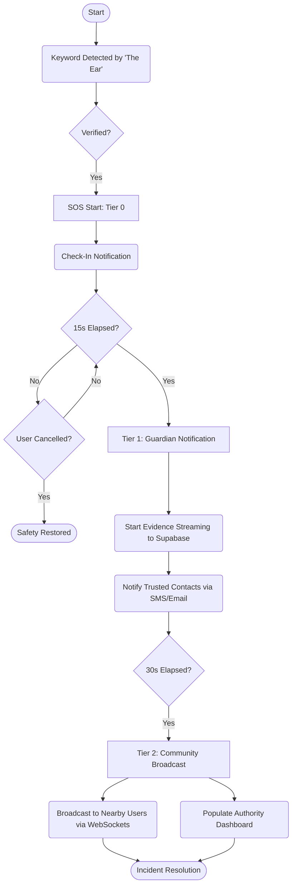

# 🛡️ RAKSHAK: Unified Safety Protocol

**RAKSHAK** is a next-generation emergency response ecosystem designed to provide a high-reliability safety net for personal security. By combining **on-device machine learning**, **real-time WebSocket broadcasting**, and **multi-tier escalation logic**, RAKSHAK transforms passive monitoring into active protection.

### 📥 [Demo Video](https://drive.google.com/file/d/13Qjk0j1lr2g3Swm_Z4AerXLqlsmP2xQ2/view?usp=drivesdk)

---

## ✨ Key Features

### 🎙️ "The Ear": Voice-Activated SOS
- **Continuous Monitoring**: A lightweight, edge-AI component that listens for distress keywords (e.g., "Bachao") even when the app is in the background.
- **Biometric Signature**: Utilizes personalized acoustic features to trigger alerts only for the authorized user.
- **Redundant Cloud Verification**: Secondary ML processing on the backend ensures high precision in noisy environments.

### 🚨 Tiered Escalation System
- **0-15s (Check-In)**: Silent verification via the mobile app to handle false alarms.
- **15s (Guardian Alert)**: Immediate notification to trusted contacts with live location and audio snippets.
- **30s (Community Broadcast)**: Geospatial alert to all RAKSHAK users within a 200m radius, turning bystanders into responders.

### 🎥 Real-Time Evidence Streaming
- **Dual-Stream Upload**: Simultaneous streaming of audio and video chunks to **Supabase Storage** during an active SOS.
- **Authority Dashboard**: A dedicated command center where emergency responders can view live map tracking and play back evidence buffers in near real-time.

### 🔒 Privacy-First Engineering
- **On-Device Inference**: Primary keyword detection happens locally on the device (TFLite) to ensure no audio ever leaves the phone unless a threat is detected.
- **Encrypted Evidence**: All transmitted data is secured using AES-256 and stored in high-availability cloud buckets.

---

## 🛠️ Technology Stack

| Component | Technology | Role |
| :--- | :--- | :--- |
| **Mobile** | React Native (Expo) | UI, Sensor Acquisition, "The Ear" Monitoring |
| **Backend** | Python / Django | Alert Coordination, Escalation Engine, API Layer |
| **Real-time** | Django Channels (WebSockets) | Live Location Broadcasting, Handshake Protocol |
| **ML Engine** | TFLite / SpeechRecognition | On-device & Cloud-based Threat Detection |
| **Storage** | Supabase Buckets | Real-time Evidence (Audio/Video) Hosting |
| **Database** | MongoDB Atlas | Geospatial Indexing, Event Logs, User Management |

---

## 🔄 Core Technical Flow



---

## 📂 Project Structure

```bash
Rakshak/
├── mobile/            # React Native app with "The Ear" (Audio Monitoring)
├── backend/           # Django API, WebSockets (Channels), and Evidence Handlers
├── ml/                # TFLite Training scripts & Voice Enrollment modules
└── docs/              # Detailed Technical Documentation & Diagrams
```

---

## 📖 Deep Dive

- [📘 Project Documentation](DOCUMENTATION.md) - **Full system overview, architecture, and SOS pipeline.**
- [🚀 Installation Guide](docs/INSTALLATION_GUIDE.md) - Setup for Backend, Mobile, and Infrastructure.
- [🔗 Connection Verification](docs/CONNECTION_VERIFICATION_REPORT.md) - API & WebSocket testing logs.
- [📊 System Diagrams](docs/SYSTEM_DIAGRAMS.md) - Logical flows and data schemas.

---

> [!NOTE]
> Created with a mission to empower and protect. Performance, Privacy, and Precision.
