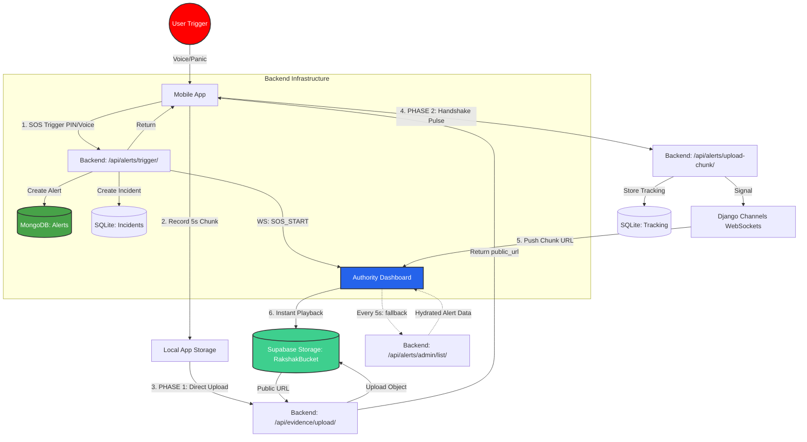

# RAKSHAK: Technical Workflow Architecture

This flowchart illustrates the unified "Supabase Handshake" and SOS alerting pipeline, ensuring high-integrity evidence streaming and real-time authority response.

### 🔐 Multi-Tier Authentication
*   **Mobile App:** Uses **JWT (JSON Web Token)** for stateless, secure API access via `PyMongoJWTAuthentication`.
*   **Authority Dashboard:** Uses **Django Session/Cookies** for seamless browser-based access and polling via `SessionAuthentication`.
